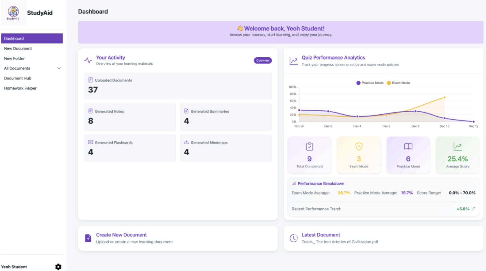
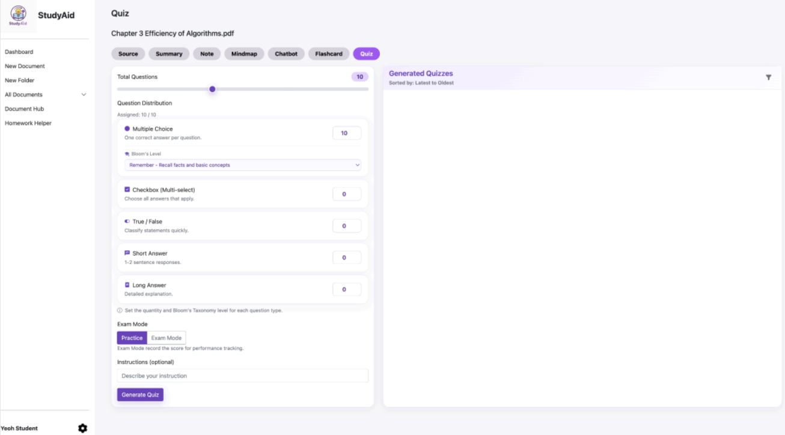
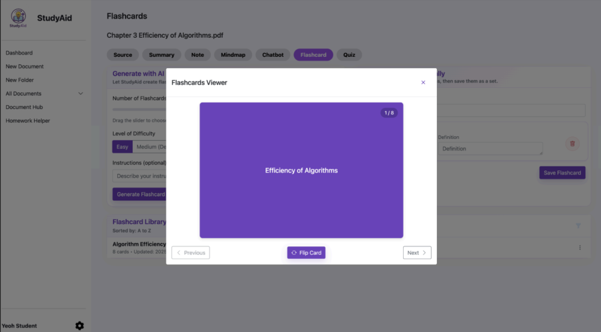
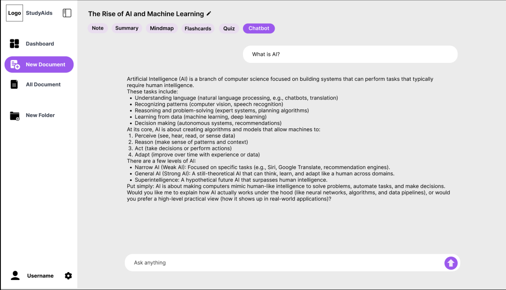

# StudyAid

StudyAid is a PHP-based web application that helps students convert uploaded study materials into structured learning outputs, including summaries, notes, mindmaps, flashcards, quizzes, and document-grounded Q&A.

---

## Overview

StudyAid streamlines how students process and learn from large volumes of study materials.

It integrates document management, OCR extraction, and AI-powered generation into a unified workflow, enabling users to transform raw content into structured learning outputs such as summaries, flashcards, and quizzes, as well as perform document-grounded Q&A across multiple sources.

---

## Key Features

- **Document and folder management**
  - Supports upload, search, move, rename, and delete flows for study files and folders.
- **OCR text extraction**
  - Implemented Tesseract as the primary OCR engine with Google Vision fallback.
- **AI learning artifact generation**
  - Implemented generation pipelines for summaries, notes, mindmaps, flashcards, and quizzes.
- **Document-grounded chat**
  - Implemented retrieval-based Q&A using stored document chunks and embeddings.
- **Quiz generation and evaluation**
  - Implemented mixed-type quiz generation, answer evaluation, and attempt tracking.
- **Homework helper**
  - Implemented OCR + AI pipeline to detect explicit questions and return structured answers.
- **Text-to-speech (TTS)**
  - Implemented local Piper-based audio generation for document-derived content.
- **Dashboard analytics**
  - Implemented activity metrics and quiz performance visualization.

---

## Screenshots

> Screenshots are included for key modules to illustrate user flows and UI behavior.

### Dashboard


### Quiz System


### Flashcard


### Chatbot


---

## Architecture

- Custom MVC-style PHP architecture (`controllers`, `models`, `services`, `views`)
- Front controller routing via `index.php`
- Apache rewrite rules in `.htaccess`
- Server-rendered pages with AJAX endpoints for interactive operations

### Request Flow

```text
HTTP Request
  -> index.php (front controller)
  -> Router / Controller dispatch
  -> Controller action
  -> Service / Model layer
  -> Database and/or external APIs
  -> HTML view or JSON response
```

---

## Tech Stack

### Backend
- PHP (custom MVC-style implementation)
- MySQL (PDO)

### Frontend
- HTML, CSS, JavaScript
- Bootstrap
- jQuery + Fetch API

### Infrastructure and Runtime
- Apache (XAMPP-oriented local setup)
- Composer (dependency management)

### Integrations
- Gemini API (content generation and embeddings)
- Google Cloud Storage (document and audio object storage)
- Google Vision API (OCR fallback)
- Tesseract OCR (primary OCR)
- Piper (local TTS)
- PHPMailer (SMTP email delivery)

---

## Project Structure

```text
app/
  config/        Environment and route configuration
  controllers/   Request orchestration and endpoint logic
  models/        Database and storage data access
  services/      AI, OCR, TTS, export, email, rate-limit services
  views/         Server-rendered UI templates (PHP + JS)

public/          Static assets (CSS/images/icons)
vendor/          Composer dependencies
models-piper/    Piper model artifacts
temp/            Runtime temp/cache files
```

---

## Database Overview

### Core domain
- `user`: account and profile status
- `folder`, `file`: document hierarchy, metadata, extracted text

### Generated learning content
- `summary`, `note`, `mindmap`, `flashcard`
- `audio`: generated TTS metadata linked to source content

### Assessment
- `quiz`, `question`, `option`, `quiz_attempt`, `useranswer`

### Retrieval and chat
- `documentchunks`: chunked text + embeddings for retrieval
- `chatbot`, `questionchat`, `responsechat`: document chat history

### Homework workflow
- `homework_helper`: upload, processing state, detected question, generated answer

---

## Local Setup

### 1) Install dependencies

```bash
composer install
```

### 2) Prepare database

1. Create a MySQL database named `studyaid`.
2. Import `studyaid.sql` into that database.

### 3) Configure environment-specific files

Update configuration values in:
- `app/config/database.php`
- `app/config/gemini.php` (or local override if used)
- `app/config/cloud_storage.php`
- `app/config/email.php`

### 4) Install required local tools

- Tesseract OCR
- Piper TTS binary and model files

### 5) Run application

1. Start Apache and MySQL (for example, via XAMPP).
2. Open:

```text
http://localhost/studyaid
```

---

## Contribution Scope

This project was developed by a two-person team.

My primary contributions:
- **Dashboard and analytics**
  - Designed and implemented aggregation queries and analytics UI integration.
- **Quiz system**
  - Designed and implemented quiz generation and evaluation workflows with persistent result tracking
- **Flashcard module**
  - Implemented CRUD and review flow for flashcard sets.
- **RAG-based chatbot**
  - Integrated chunk retrieval logic with AI response generation.
- **Homework helper**
  - Implemented OCR-to-answer pipeline for uploaded homework files.

Additional engineering contributions:
- Traced and documented end-to-end request flow
- Analyzed architecture and module boundaries
- Integrated AI services into backend feature workflows

These components required coordinating multiple subsystems, including OCR processing, retrieval-based context generation, and AI-driven response pipelines.

---

## Design Considerations

- **Pragmatic monolith architecture:** Chosen to keep deployment and iteration simple for an academic product scope.
- **Server-rendered first, AJAX where needed:** Reduced frontend complexity while enabling interactive generation flows.
- **Retrieval-based context for AI calls:** Added chunk + embedding retrieval to improve relevance over full-document prompting.
- **Service abstraction:** Isolated OCR, LLM, TTS, email, and export logic under `app/services/`.

---

## Limitations

- Depends on external services and credentials (Gemini, Google Cloud, SMTP).
- Local runtime requires additional binaries (Tesseract, Piper).
- Some areas still need production hardening (CSRF protection, session/security controls, secrets management).
- Large model/dependency assets increase repository size and setup time.

---

## Future Improvements

- Strengthen security controls (CSRF protection, session hardening, stricter validation).
- Refactor large controllers/models into smaller domain-focused modules.
- Improve performance for large-document ingestion and retrieval workloads.
- Standardize frontend architecture and reduce duplicated client-side logic.
- Externalize secrets/configuration with environment-based management.